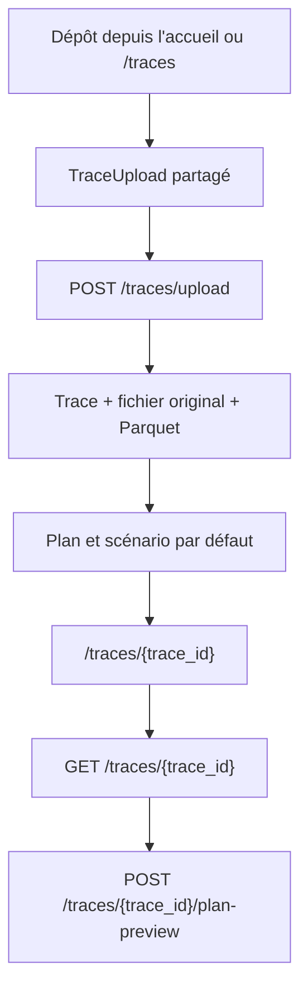

# Préparation de course sur une trace

## Objectif

Ce document décrit le domaine des traces théoriques, la page `/traces/{trace_id}`, le pipeline de calcul et les contrats API de préparation de course. Il s'adresse aux développeurs backend et frontend.

## Périmètre

Sont couverts : import GPX/FIT d'une trace, stockage Parquet, profil terrain, objectifs, plans, scénarios, pauses, passages, graphiques et comparaison. Les activités réellement enregistrées restent documentées séparément dans `docs/metrics_catalog.md`.

Ne sont volontairement pas pris en charge : export montre, roadbook, impression, export CSV, fourchettes d'incertitude, fatigue progressive, stratégie positive/négative et modélisation du terrain ou de la surface.

## Deux domaines et deux identifiants

| Domaine | Identifiant | Route de détail | Usage |
|---|---|---|---|
| Activité réelle | `activity_id` | `/activities/{activity_id}` | Séance effectivement enregistrée |
| Trace théorique | `trace_id` | `/traces/{trace_id}` | Parcours et préparation d'une course future |

Un `trace_id` n'est jamais essayé comme `activity_id`, et inversement. Les types frontend `TraceId` et `ActivityId` sont des types marqués distincts dans `frontend/src/types/api.ts`.

Les routes historiques qui mélangeaient les domaines répondent désormais HTTP 410 avec l'en-tête `Deprecation: true` :

- `GET /activity/{activity_id}/theoretical` ;
- `POST /traces/{trace_id}/open` ;
- `GET /activity/{activity_id}/trace-status` ;
- `POST /activity/{activity_id}/trace-save`.

## Flux unique d'import

La page d'accueil et `/traces` utilisent toutes deux `frontend/src/components/upload/TraceUpload.tsx`, `useUploadTrace()` et `POST /traces/upload`.



L'import accepte uniquement `.gpx` et `.fit`, vérifie la taille maximale et valide le profil avant la création de la trace. La réponse contient une trace, jamais un `activity_id`.

## Stockage et priorité au Parquet

Chaque trace est stockée sous `data/traces/{trace_id}/` avec le fichier original, `df.parquet` et `meta.json`. La table `traces` conserve aussi le chemin Parquet et les informations de validation.

Ordre de chargement :

1. vérifier l'existence du Parquet et de ses métadonnées ;
2. vérifier `dataframe_schema_version` ;
3. comparer `parquet_source_hash_sha256` à l'empreinte connue du fichier source ;
4. lire directement le Parquet ;
5. valider le contrat du DataFrame canonique.

Le GPX/FIT original n'est reparsé que si le Parquet est absent, illisible, incompatible, invalide ou si l'empreinte source a changé. La reconstruction est journalisée avec une raison, puis met à jour :

- `parquet_source_hash_sha256` ;
- `dataframe_schema_version` ;
- `parquet_generated_at_utc` ;
- les métriques statiques de la trace si le fichier source a changé.

`GET /traces/{trace_id}` expose `file.parquet_source` (`parquet` ou `rebuilt`) et `file.parquet_rebuild_reason`.

## Profil terrain canonique

Le module `backend/core/course_profile.py` est la source commune du profil théorique.

| Paramètre | Valeur par défaut | Rôle |
|---|---:|---|
| Grille régulière | 10 m | Rééchantillonnage indépendant de la densité source |
| Fenêtre de lissage altitude | 50 m | Réduction du bruit altimétrique |
| Fenêtre de pente robuste | 50 m | Régression locale stable |
| Fenêtre de pente d'affichage | 30 m | Série visuelle distincte |
| Limite de pente affichée | ±40 % | Protection de l'affichage, sans modifier la pente robuste utilisée par les classes |

Le pipeline normalise la première distance à zéro, déduplique les distances, contrôle leur monotonie, utilise la distance horizontale, interpole les altitudes manquantes et corrige les pics altimétriques. Les distances internes sont en mètres ; toutes les distances API sont explicitement en kilomètres.

Les sorties distinguent :

- `grade_raw_pct` : pente locale brute ;
- `grade_robust_pct` : pente utilisée par Minetti et les histogrammes ;
- `grade_pct` : pente destinée à l'affichage.

La qualité fournit notamment le taux d'interpolation, le taux de correction, la densité de points, les trous de signal, la qualité altimétrique et des avertissements structurés.

## Pipeline théorique unique

`backend/services/race_planning_service.py` réalise dans un seul calcul :

1. profil canonique ;
2. coût énergétique Minetti ;
3. allure segmentaire ;
4. temps cumulés ;
5. splits kilométriques ;
6. ascensions ;
7. passages et points personnalisés ;
8. pauses ;
9. histogrammes ;
10. alertes et stratégie calculée ;
11. qualité et météo disponible.

Le modèle de pente accepté est `minetti`. `pro_ref` n'est pas un alias et est refusé pour une trace.

### Objectifs

Le stockage et l'API utilisent une valeur numérique canonique :

| `objective_type` | Unité API de `target_value` | Saisie frontend |
|---|---|---|
| `pace` | secondes par kilomètre | `min:ss`, par exemple `5:30` |
| `time` | secondes totales | `hh:mm:ss`, par exemple `03:45:00` |
| `effort` | ratio de VMA | pourcentage, par exemple `75` pour `0.75` |

Pour un temps cible, une dichotomie résout l'allure de base afin que la somme des temps segmentaires corresponde au temps demandé avec une tolérance inférieure à une seconde.

Le coût Minetti n'est pas écrêté sur l'axe des allures. La pente d'entrée du polynôme reste limitée à `−30 % / +30 %`, plage de sécurité du modèle. L'axe Y du graphique est calculé à partir des minima et maxima de la série, sans borne fixe.

## Plans, scénarios et pauses

Un plan appartient à une trace. Un scénario appartient à un plan. Les résultats de `plan-preview` ne sont pas la source persistée : ils sont recalculés à partir du scénario, des pauses, du profil et de la version du pipeline.

Un plan contient notamment la date, l'heure de départ, le fuseau IANA, le scénario actif, les notes, le matériel et les points remarquables. Un scénario contient l'objectif, Minetti, la VMA, la calibration, les hypothèses météo, les portions stratégiques, la nutrition et les pauses.

Types de pause : `water`, `nutrition`, `assistance`, `other`.

Pour une pause à la distance `d` :

- les passages strictement avant `d` ne changent pas ;
- le passage à `d` et tous les passages suivants sont décalés de sa durée ;
- plusieurs pauses s'additionnent exactement ;
- `running_time_s` reste le temps de course ;
- `stop_time_s` est la somme des pauses ;
- `elapsed_time_s = running_time_s + stop_time_s`.

Si le plan contient `race_date`, `start_time` et un fuseau valide, les passages et l'arrivée reçoivent une date ISO avec fuseau.

## Trois graphiques calculés côté backend

### Allure vs distance

`profile[]` fournit directement : `distance_km`, `pace_s_per_km`, `elevation_m`, `grade_pct`, `grade_robust_pct`, `elapsed_time_s`, `passage_time_iso`, `lat` et `lon`.

Le frontend ne lisse pas et ne recalcule pas l'allure. Le downsampling backend est basé sur la distance et conserve les extrema d'altitude et de pente.

### Temps par allure

`histograms.pace.complete_classes` conserve toutes les classes pour le contrôle d'intégrité. `display_classes` applique uniquement :

- temps de classe supérieur ou égal à 90 secondes ;
- allure de classe inférieure ou égale à `1,75 ×` l'allure de référence.

`total_time_s`, `displayed_time_s` et `hidden_time_s` rendent les filtres explicites.

### Temps par pourcentage de pente

`histograms.grade` utilise `grade_robust_pct`. Les classes complètes conservent temps, distance et pourcentage du temps total. L'affichage applique le seuil de 90 secondes et regroupe les extrêmes sous `≤ −20 %` et `≥ +20 %`.

Le graphique frontend réserve toujours une grille symétrique de `−20 %` à `+20 %`, ce qui place `0 %` au centre même si certaines classes sont absentes.

## Routes API

| Méthode | Route | Fonction |
|---|---|---|
| `POST` | `/traces/upload` | Import partagé GPX/FIT |
| `GET` | `/traces/{trace_id}` | Trace, fichier, qualité et plans minimaux |
| `POST` | `/traces/{trace_id}/plan-preview` | Calcul pur d'un aperçu |
| `GET` | `/traces/{trace_id}/calibration` | Suggestion à partir des activités réelles comparables |
| `GET/POST` | `/traces/{trace_id}/plans` | Liste et création |
| `GET/PATCH/DELETE` | `/traces/{trace_id}/plans/{plan_id}` | Détail, modification et suppression |
| `POST` | `/traces/{trace_id}/plans/{plan_id}/scenarios` | Création d'un scénario |
| `PATCH/DELETE` | `/traces/{trace_id}/plans/{plan_id}/scenarios/{scenario_id}` | Modification, activation et suppression |
| `POST` | `/traces/{trace_id}/plans/{plan_id}/scenarios/{scenario_id}/stops` | Création d'une pause |
| `PATCH/DELETE` | `/traces/{trace_id}/plans/{plan_id}/scenarios/{scenario_id}/stops/{stop_id}` | Déplacement, modification et suppression |
| `POST` | `/traces/{trace_id}/plans/{plan_id}/compare` | Comparaison de deux scénarios ou plus |

Exemple de prévisualisation : `docs/sample_trace_plan_preview.json`.

Exemple de requête à partir d'un plan persisté :

```json
{
  "plan_id": "6b7d6ff8-43df-4d52-a54a-1fe921db3408",
  "scenario_id": "7badd42d-ef66-46cc-a745-f56b9ad5bc64"
}
```

Exemple de calcul pur sans persistance préalable :

```json
{
  "plan": {
    "race_date": "2026-09-12",
    "start_time": "08:00",
    "timezone": "Europe/Paris"
  },
  "scenario": {
    "name": "Objectif principal",
    "objective_type": "pace",
    "target_value": 330,
    "slope_model": "minetti",
    "calibration_factor": 1,
    "is_active": true,
    "stops": []
  },
  "stops": [
    {
      "distance_km": 8,
      "stop_type": "water",
      "duration_s": 120,
      "notes": "Remplir les flasques"
    }
  ]
}
```

## Page `/traces/{trace_id}`

La page route ne fait que convertir le paramètre en `TraceId` et rendre `TracePlanningPage`. `useTracePlanning` charge la trace, le plan actif, le scénario sélectionné et le preview.

Sections : hero/KPI, paramètres, aperçu, carte et profil synchronisés, splits/ascensions/passages, pauses, stratégie, nutrition, matériel, graphiques, comparaison et qualité.

La date est conservée localement pendant la saisie afin qu'un rafraîchissement React Query ne remplace pas une année partiellement saisie. Une date ISO complète ou le choix « Aujourd'hui » du calendrier natif déclenche la persistance.

## Migration

La migration `20260714_race_planning` est idempotente et enregistrée dans `schema_migrations`.

```powershell
Push-Location backend
..\.venv\Scripts\python.exe -m db.migrations.run
Pop-Location
```

L'initialisation backend applique également cette migration après `Base.metadata.create_all()`.

## Vérification

```powershell
.\.venv\Scripts\python.exe -m pytest -q

Push-Location frontend
npm test
npx tsc --noEmit
npm run build
Pop-Location
```
